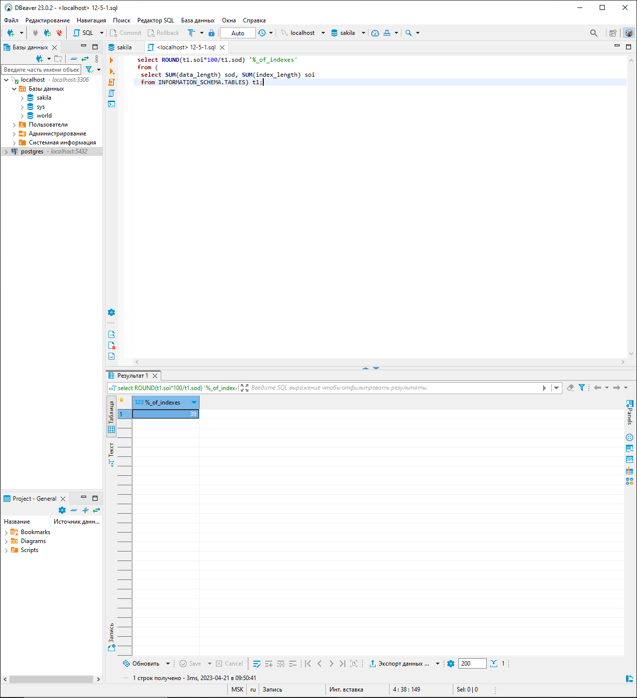
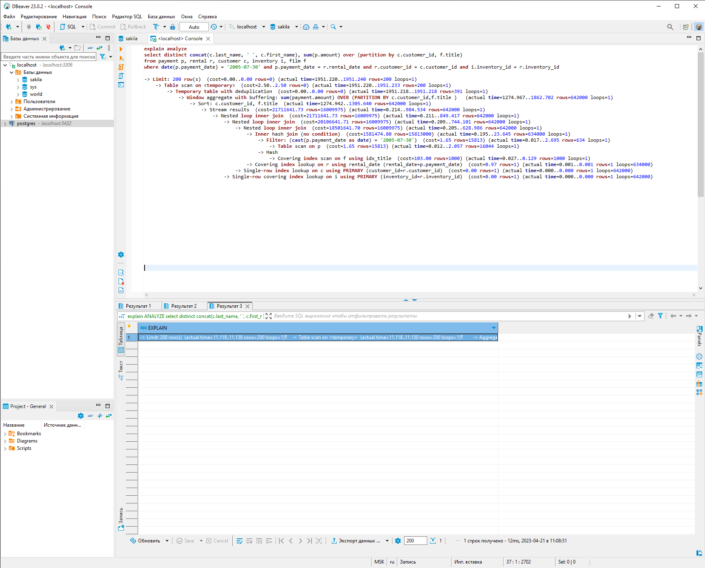
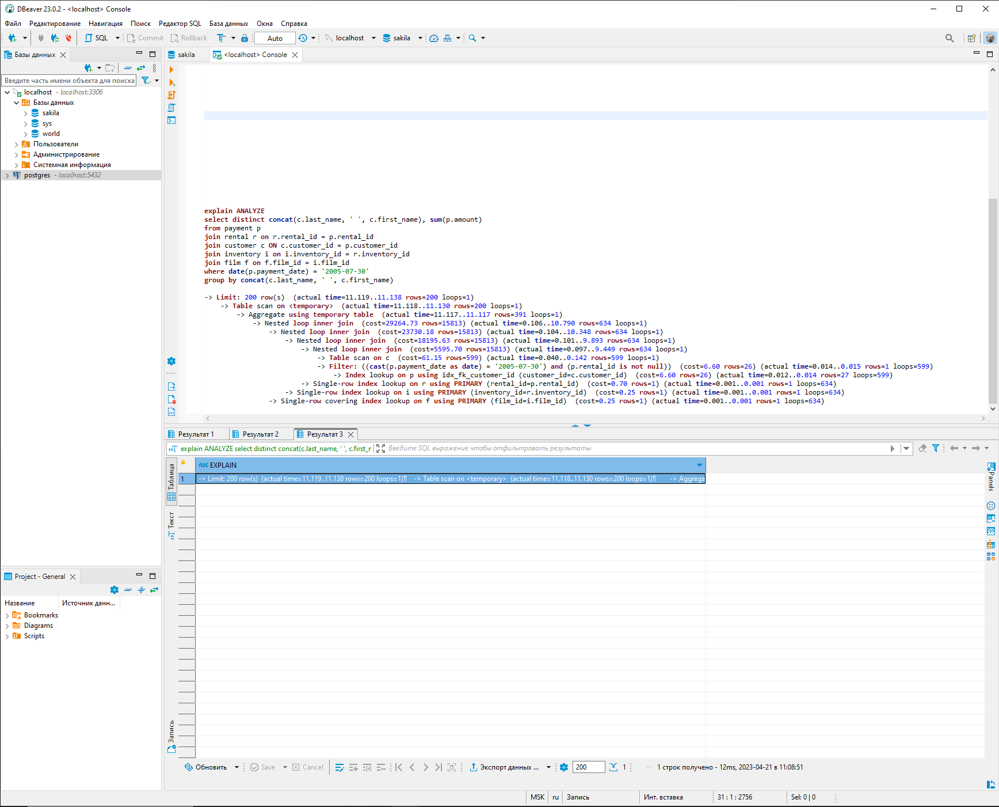

# Домашнее задание к занятию «Индексы»

---

### Задание 1

Напишите запрос к учебной базе данных, который вернёт процентное отношение общего размера всех индексов к общему размеру всех таблиц.
```sql
 select ROUND(t1.soi*100/t1.sod) '%_of_indexes'
 from (
  select SUM(data_length) sod, SUM(index_length) soi
  from INFORMATION_SCHEMA.TABLES) t1;
```


---

### Задание 2

Выполните explain analyze следующего запроса:
```sql
select distinct concat(c.last_name, ' ', c.first_name), sum(p.amount) over (partition by c.customer_id, f.title)
from payment p, rental r, customer c, inventory i, film f
where date(p.payment_date) = '2005-07-30' and p.payment_date = r.rental_date and r.customer_id = c.customer_id and i.inventory_id = r.inventory_id
```
- перечислите узкие места;

Узкие места наблюдаются в момент использования оконных функций OVER и PARTITION BY, а  так же в  момент фильтрации вывода, в сравнении колонок из разных таблиц.
- оптимизируйте запрос: внесите корректировки по использованию операторов, при необходимости добавьте индексы.
```sql
select distinct concat(c.last_name, ' ', c.first_name), sum(p.amount) 
from payment p
join rental r on r.rental_id = p.rental_id 
join customer c ON c.customer_id = p.customer_id 
join inventory i on i.inventory_id = r.inventory_id 
join film f on f.film_id = i.film_id 
where date(p.payment_date) = '2005-07-30' 
group by concat(c.last_name, ' ', c.first_name); 
```


---

### Задание 3*

Самостоятельно изучите, какие типы индексов используются в PostgreSQL. Перечислите те индексы, которые используются в PostgreSQL, а в MySQL — нет.

*Приведите ответ в свободной форме.*

- Bitmap index – метод битовых индексов заключается в создании отдельных битовых карт для каждого возможного значения столбца, где каждому биту соответствует строка с индексируемым значением, а его значение равное 1 означает, что запись, соответствующая позиции бита содержит индексируемое значение для данного столбца или свойства.
- Partial index — это индекс, построенный на части таблицы, удовлетворяющей определенному условию самого индекса. Данный индекс создан для уменьшения размера индекса.
- Function-based index - индексы, ключи которых хранят результат пользовательских функций.


